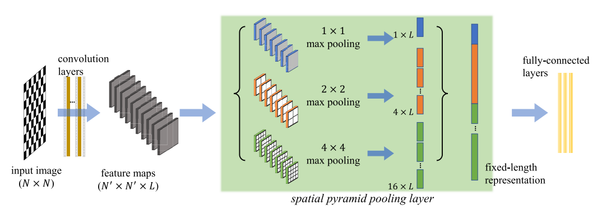

# SPP-CNN: An Efficient Framework for Network Robustness Prediction

## The proposed approach



SPP-CNN is an efficient method for network robustness approximation based on *Spatial Pyramid Pooling*, Its contributions are as follows:

- SPP-CNN is proposed, which has a wider tolerance to different input-data sizes than the CNN- and GNN-based approaches, while maintaining fast approximation speed like the CNN-based approaches. Together with the sorting strategy, the robustness prediction performance of SPP-CNN significantly outperforms the other CNN- and GNN-based approaches.
- SPP-CNN shows stronger generalizability than the other approaches on predicting the network robustness for datasets with unseen topologies and sizes. 
- SPP-CNN demonstrates better performances than the other approaches on predicting the robustness of real-world networks, with consistent advantages for both synthetic and real-world networks.

## Dependencies
- networkx==2.8
- numpy==1.19.5
- scikit_learn==1.0.2
- scipy==1.8.0
- tensorflow==2.6.0

## Usage

To make it easier for your dataset to be used directly in the code, it is recommended to keep the training data format the same as in this code. Otherwise, you will need to modify the code in the data loading part to suit your own dataset.

### Install

` conda install --yes --file requirements.txt`

### Train & Test

```
python train.py # Train model
python test.py # Test model using the prepared trained model
```


### The Prepared Dataset

> 4(300,700)_nrnd_isd0_isw0.mat

- 4 types of networks: {ER, QS, SF, SW-NW}, each type include 500 instances, totally 2000 instances.
- For all networks, using random node removing attack (nrnd) to calculate the robustness.
- All network sizes range from 300 to 700.
- All networks are undirected(isd0) and unweighted(isw0).

## Cite

This paper has been formally published: https://ieeexplore.ieee.org/document/10197169

Please cite our paper if you use this code in your research work.

```tex
@article{Wu2023TCASI,
  author={Wu, Chengpei and Lou, Yang and Wang, Lin and Li, Junli and Li, Xiang and Chen,   Guanrong},
  journal={IEEE Transactions on Circuits and Systems I: Regular Papers}, 
  title={SPP-CNN: An Efficient Framework for Network Robustness Prediction}, 
  year={2023},
  volume={},
  number={},
  pages={1-13},
  doi={10.1109/TCSI.2023.3296602}
}
```